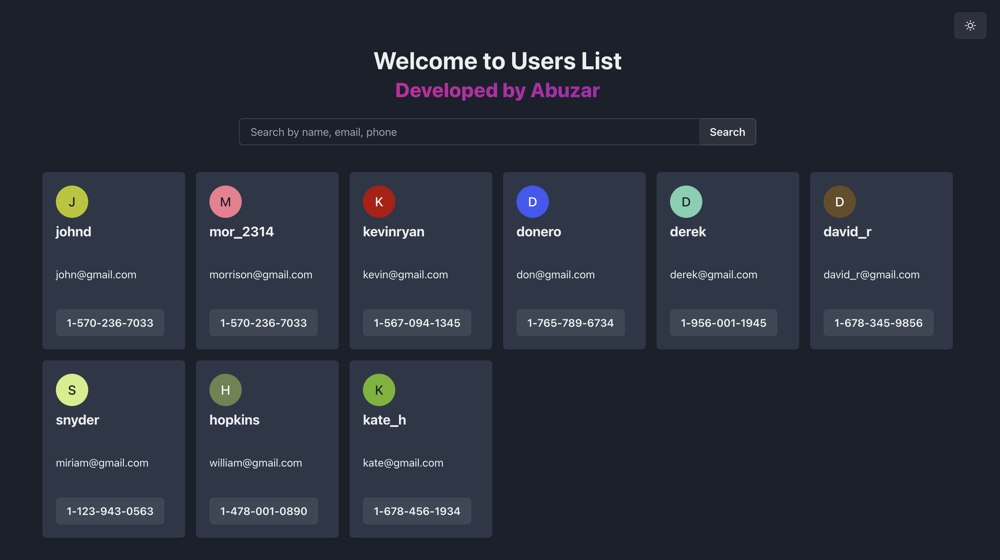

# REALMOND TEST APP



## Introduction

This application is built using Vite + React + TypeScript

## Tech stack

- React
- Vite
- TypeScript
- React Query
- Axios
- Chakra UI
- TailwindCSS

## Architecture

Feature-Sliced Design (FSD). I'm using [Steiger](https://github.com/feature-sliced/steiger) (the official linter for FSD). In order to check the architecture and folder structure run the following command:

```bash
yarn lint:fsd
```

To lint the project run:

```bash
yarn lint
```

To install the project (dependencies) run:

```bash
yarn
```

To start the local server in dev mode run:

```bash
yarn dev
```

To build the project for production run:

```bash
yarn build
```

To start the local server in production mode run:

```bash
yarn preview
```
